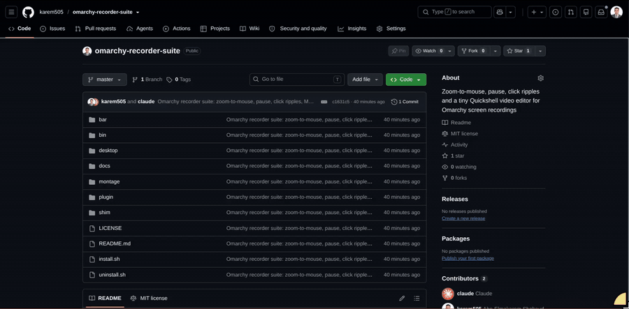

# Omarchy Recorder Suite

Screen-recording superpowers for [Omarchy](https://omarchy.org): live
zoom-to-mouse, pause/resume, click ripple waves — plus **Montage**, a tiny
Quickshell video editor that opens straight from the "recording saved"
notification.

Everything installs into user-owned locations only. Nothing under
`/usr/share/omarchy` is modified, so `omarchy update` never breaks it.



## Features

### While recording (`omarchy screenrecord`)

- **Zoom to mouse (F2)** — smooth animated compositor zoom that follows the
  cursor, captured live in the recording (Screen Studio / Recordly style).
  Uses Hyprland's `cursor.zoom_factor`, so it works with any recorder.
  `zoom-to-mouse in|out|reset|toggle [factor]` for finer control.
- **Pause / resume (ALT + P)** — toggles gpu-screen-recorder's native pause
  (paused time simply isn't in the video). Falls back to an
  `obs-record-pause-toggle` script if you have one, so a single key serves
  both recorders.
- **Click ripples** — expanding accent-colored waves at the cursor on every
  left click, drawn by a click-through Quickshell overlay so your clicks are
  visible in the recording. Zero cost while not recording; clicks pass
  through untouched (non-consuming bind).
- **Bar status widget** — shows `paused` and the current zoom level next to
  your other indicators; click it to pause/resume.

### After recording

- The **"Screen recording saved" notification opens Montage** instead of mpv
  when you stop with ALT + PRINT; stops from the bar indicator or capture
  menu raise an extra "Edit recording" notification instead. Either way, one
  click lands you in the editor.
- **Montage** (`montage-editor <file>`, also in your app launcher and the
  file manager's *Open With…* menu):
  - image overlay layer: drag to place, corner-grip / slider / wheel to
    resize, time range pinned to the playhead
  - cut sections: mark in/out at the playhead, ranges show red on the
    timeline, removed on export with audio kept in sync
  - zoomable filmstrip timeline with real frame thumbnails (Ctrl+wheel zooms
    around the cursor, wheel pans, click/drag seeks)
  - ffmpeg export with progress, saved as `<name>-montage.mp4`
  - themed from your active Omarchy theme (`colors.toml`, watched live) with
    a design borrowed from [omacut](https://github.com/basecamp/omacut)

## Requirements

- Omarchy (v4 era: Lua-config Hyprland, Quickshell shell) with
  `gpu-screen-recorder` as the recording backend (the default)
- `quickshell` 0.3+, `ffmpeg`, `jq`
- `qt6-multimedia` + `qt6-multimedia-ffmpeg` for Montage's video preview

## Install

```bash
git clone https://github.com/karem505/omarchy-recorder-suite
cd omarchy-recorder-suite
./install.sh
```

The installer backs up `~/.config/hypr/bindings.lua` and
`~/.config/omarchy/shell.json` before touching them, appends a clearly
marked keybinding block, enables the shell plugin and bar widget, registers
the desktop entry, and reloads Hyprland + the shell.

**Key conflicts:** if ALT + P or F2 are already bound on your setup, trim
the `omarchy-recorder-suite` block at the bottom of
`~/.config/hypr/bindings.lua` to taste (add `hl.unbind(...)` lines or pick
other keys).

## Keys

| Key | Action |
|-----|--------|
| `ALT + PRINT` | Start / stop recording (stock flow, editor-wired notification) |
| `ALT + P` | Pause / resume recording |
| `F2` | Toggle zoom-to-mouse (forwards to OBS when idle) |
| left click | Ripple wave (only while recording) |
| **Montage:** `Space` | play / pause |
| `I` / `O` | mark cut in / out |
| `←` / `→` | seek 1s |
| `+` / `-` / Ctrl+wheel | timeline zoom |

## How it works

- `screenrecord-toggle` wraps the stock recording toggle with a tiny PATH
  shim that rewrites the saved-notification's `--exec 'mpv <file>'` into
  `montage-editor <file>` — no packaged files are edited.
- A `flock`-singleton watcher (run by the shell service plugin) catches
  recordings stopped through any other path and sends its own "Edit
  recording" notification, deduplicated against the shim.
- The click ripple is a `service`-kind Omarchy shell plugin: a click-through
  layer-shell overlay whose surface only exists while a wave is animating,
  triggered per click through `omarchy-shell` IPC by a non-consuming
  `mouse:272` bind.
- Montage is a standalone Quickshell config (`quickshell -p
  ~/.config/quickshell/montage`), launched by a probe script that passes
  resolution / duration / audio facts through the environment. Export is a
  single ffmpeg filtergraph (`overlay` + `select`/`aselect`).

## Uninstall

```bash
./uninstall.sh
```

## Credits

- [Omarchy](https://omarchy.org) by DHH & contributors
- [omacut](https://github.com/basecamp/omacut) for the editor's design language
- [gpu-screen-recorder](https://git.dec05eba.com/gpu-screen-recorder/) for the
  recording backend (and its SIGUSR2 pause)
